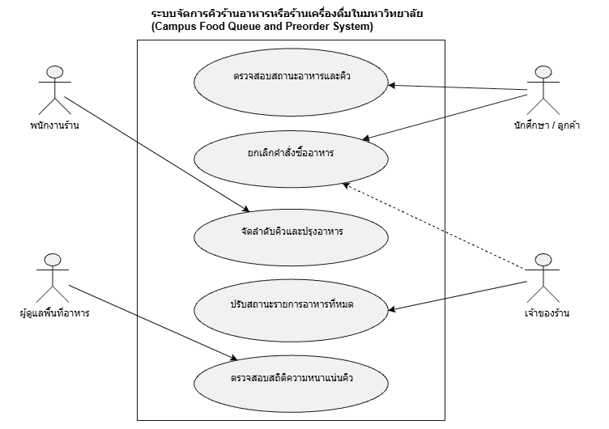

# Use Case Diagrams

ใส่ use case diagram และเชื่อมกับ UC-ID ใน docs/06

## Checklist

- [x] มี source file ที่แก้ไขได้
- [x] มี PNG/PDF export สำหรับใช้ในเอกสาร
- [x] ชื่อไฟล์สื่อถึง purpose
- [x] เชื่อมโยงกับ requirement/design document
