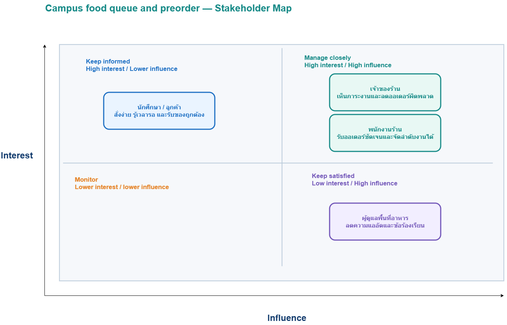
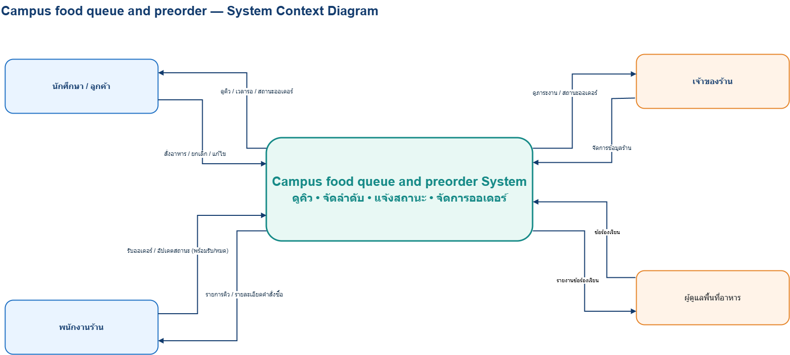

# Week 02 — Stakeholder, Context and Scope

> **Team:** Group04 - Campus food queue and preorder 
> **Case:** ระบบจัดการคิวร้านอาหารหรือร้านเครื่องดื่มในมหาวิทยาลัย (Case 04)
> **Version:** v0.2
> **Last updated:** 2026-07-10
> **Diagram source of truth:** `StakeholderMap_2.drawio`, `System Context Diagram_2.drawio`

---

## 1. Problem Frame (revised)

### 1.1 สถานการณ์ปัจจุบัน
ในช่วงพักระหว่างคาบเรียน ร้านอาหารและร้านเครื่องดื่มในมหาวิทยาลัยมีลูกค้าจำนวนมาก ปัจจุบันนักศึกษาต้องยืนรอโดยไม่ทราบเวลารอที่แท้จริงในขณะที่ร้านค้ารับคำสั่งซื้อด้วยเสียงหรือการจดกระดาษ ซึ่งทำให้เกิดความผิดพลาดในการสื่อสาร ส่งผลให้เกิดการรับสินค้าผิดคน และเกิดความแออัดบริเวณหน้าเคาน์เตอร์

### 1.2 ใครได้รับผลกระทบ
- **นักศึกษา / ลูกค้า:** เสียเวลามายืนรอโดยไม่รู้เวลาที่แน่นอน และเกิดการสื่อสารผิดพลาดจนได้ของผิดคน
- **พนักงานร้าน:** การรับออเดอร์ด้วยเสียงหรือกระดาษทำให้เกิดความสับสน และมักทำรายการผิดพลาดในช่วงที่คนเยอะ
- **เจ้าของร้าน:** เรื่องความผิดพลาดของออเดอร์และประสิทธิภาพในการจัดการคิว
- **ผู้ดูแลพื้นที่อาหาร:** ต้องรับมือกับปัญหาลูกค้ายืนออหน้าเคาน์เตอร์จำนวนมากในช่วงพักเที่ยง และอาจได้รับข้อร้องเรียน

### 1.3 Problem Statement
> นักศึกษาและร้านค้าประสบปัญหาระบบคิวที่ไม่มีประสิทธิภาพในช่วงเวลาเร่งด่วน เนื่องจากการรับออเดอร์ด้วยเสียงหรือกระดาษ ทำให้ผู้ซื้อไม่ทราบเวลารอและผู้ขายจัดการคิวได้ยาก

### 1.4 ผลลัพธ์ที่ต้องการ (โดยยังไม่กำหนด solution)
- ช่วยให้ผู้ใช้เห็นคิวและเวลารออย่างชัดเจน ลดการรอหน้าเคาน์เตอร์
- ช่วยให้พนักงานและร้านค้าสามารถจัดการคำสั่งซื้อได้ดี จัดลำดับงานได้ถูกต้องและแม่นยำยิ่งขึ้น
- ลดความแออัดในพื้นที่และลดปริมาณข้อร้องเรียน

### 1.5 สิ่งที่ทีมยังต้องเรียนรู้
- ลูกค้าควรยกเลิกออเดอร์ได้ถึงเมื่อไร?
- ใครคือผู้มีหน้าที่เปลี่ยนสถานะ "พร้อมรับ"?
- ข้อมูลใดบ้างที่จำเป็นต้องแสดงบนหน้าจอของร้านและของลูกค้า?
- ระบบควรจัดการอย่างไรหากเมนูหมดหลังจากที่รับออเดอร์มาแล้ว?

---

## 2. Stakeholder Inventory and Map

> **Source:** [`w02-system-context.drawio`](../diagrams/stakeholders/StakeholderMap.drawio)

| Stakeholder | Role / Current work | Goal / Need | Influence | Interest | Why it matters |
|---|---|---|---|---|---|
| พนักงานร้าน | รับออเดอร์ ทำอาหาร และจัดลำดับคิว | รับออเดอร์ชัดเจนและจัดลำดับงานได้ | High | High | เป็นผู้ดำเนินงานหลักที่ส่งผลต่อความเร็วและสถานะคิว |
| เจ้าของร้าน | ดูแลภาพรวมของร้าน จัดการข้อมูลร้าน | เห็นภาระงานและลดออเดอร์ผิดพลาด | High | High | เป็นผู้ตัดสินใจหลักด้านกฎของร้านและการใช้งานระบบ |
| ผู้ดูแลพื้นที่อาหาร | จัดการพื้นที่โรงอาหาร รับข้อร้องเรียน | ลดความแออัดและข้อร้องเรียน | High | Low | สามารถกำหนดกฎระเบียบเชิงพื้นที่ได้ แต่ไม่ได้แตะระบบโดยตรง |
| นักศึกษา / ลูกค้า | สั่งอาหาร รอคิว และรับสินค้า | สั่งง่าย รู้เวลารอ และรับของถูกต้อง | Lower | High | เป็นผู้ใช้ปลายทางที่ได้รับผลกระทบจากปัญหาเดิมมากที่สุด |

### 2.1 Stakeholder Profiles

#### Stakeholder: พนักงานร้าน
- **Goal / need:** รับออเดอร์ได้ชัดเจน ลดความสับสน และสามารถจัดลำดับงานได้
- **Pain point:** การรับออเดอร์ด้วยเสียงทำให้ทำรายการผิดพลาดช่วงคนเยอะ
- **Concern / risk:** กังวลว่าแต่ละเมนูใช้เวลาเตรียมไม่เท่ากัน หากต้องจัดคิวเองทั้งหมดอาจวุ่นวาย
- **Information this stakeholder knows:** เวลาโดยเฉลี่ยในการทำอาหารแต่ละเมนู และขั้นตอนการทำงานหน้าเตา
- **Influence / decision power:** High — เป็นผู้จัดการคิวและกดอัปเดตสถานะ "พร้อมรับ"
- **Open questions for Week 3:** ใครคือผู้มีหน้าที่เปลี่ยนสถานะอย่างเป็นทางการ และจะรับมืออย่างไรถ้าเมนูหมดกระทันหัน?

#### Stakeholder: เจ้าของร้าน
- **Goal / need:** มองเห็นภาพรวมภาระงานทั้งหมด และลดข้อผิดพลาดของออเดอร์
- **Pain point:** ต้นทุนสูญเสียจากการทำออเดอร์ผิด และจัดการพนักงานได้ยากช่วงเร่งด่วน
- **Concern / risk:** กังวลเรื่องการจัดการเมนูที่หมดระหว่างวัน และพฤติกรรมลูกค้าที่มารับของไม่ตรงเวลา
- **Information this stakeholder knows:** รายการเมนูทั้งหมดของร้าน นโยบายการจัดการออเดอร์
- **Influence / decision power:** High — เป็นผู้อนุมัติว่าจะใช้ระบบหรือไม่ และกำหนดข้อมูลร้าน
- **Open questions for Week 3:** นโยบายสำหรับลูกค้าที่สั่งแล้วยกเลิก หรือมารับช้าคืออะไร?

#### Stakeholder: นักศึกษา / ลูกค้า
- **Goal / need:** สั่งอาหารได้ง่าย รู้เวลารอที่ชัดเจน และได้รับสินค้าที่ถูกต้อง
- **Pain point:** ต้องเสียเวลายืนรอโดยไม่รู้คิว และมักได้ของผิดคนหรือออเดอร์ผิด
- **Concern / risk:** กลัวเลยคิวของตนเอง หรือสั่งไปแล้วเพิ่งทราบภายหลังว่าวัตถุดิบหมด
- **Information this stakeholder knows:** ช่วงเวลาพักของตนเอง และความต้องการสั่งอาหาร
- **Influence / decision power:** Lower — เป็นผู้รับบริการ ไม่ได้มีอำนาจตั้งกฎของร้าน
- **Open questions for Week 3:** ข้อมูลใดที่อยากเห็นบนจอมากที่สุดเพื่อประกอบการตัดสินใจสั่ง?

#### Stakeholder: ผู้ดูแลพื้นที่อาหาร
- **Goal / need:** ลดความแออัดในพื้นที่และลดข้อร้องเรียนจากนักศึกษา/ร้านค้า
- **Pain point:** ลูกค้ายืนออหน้าเคาน์เตอร์จำนวนมากในช่วงพักเที่ยง จัดการทางเดินยาก
- **Concern / risk:** ระบบใหม่อาจทำให้คนไปกระจุกตัวนั่งรอที่โต๊ะอาหารแทนหน้าเคาน์เตอร์
- **Information this stakeholder knows:** สถิติความหนาแน่นของโรงอาหาร และกฎการใช้พื้นที่
- **Influence / decision power:** High — กำหนดนโยบายพื้นที่ส่วนรวม
- **Open questions for Week 3:** ต้องการเห็นรายงานข้อร้องเรียนในรูปแบบใด?

---

## 3. System Context

> **Source:** [`w02-system-context.drawio`](../diagrams/context/SystemContextDiagram.drawio)

### 3.1 System Boundary
ขอบเขตของ **Campus food queue and preorder System** ครอบคลุมฟังก์ชันการสั่งอาหาร/รับออเดอร์ การดูคิวและจัดลำดับ การอัปเดตและแจ้งสถานะออเดอร์ รวมถึงการจัดการข้อมูลร้าน ระบบนี้ **ไม่ใช่** ระบบรับชำระเงินเต็มรูปแบบ แพลตฟอร์ม Delivery หรือระบบบัญชีหลังร้าน

### 3.2 Key Data Flows

| From → To | Data / Request | Why it matters |
|---|---|---|
| นักศึกษา → ระบบ | สั่งอาหาร / ยกเลิก / แก้ไข | เป็นจุดเริ่มต้น workflow การรับออเดอร์ทั้งหมดของร้าน |
| ระบบ → นักศึกษา | ดูคิว / เวลารอ / สถานะออเดอร์ | แก้ Pain point หลักเรื่องการยืนรอโดยไม่รู้คิว |
| พนักงานร้าน → ระบบ | รับออเดอร์ / อัปเดตสถานะ (พร้อมรับ/หมด) | ทำให้ข้อมูลในระบบตรงกับสถานการณ์หน้าเตาจริง |
| ระบบ → พนักงานร้าน | รายการคิว / รายละเอียดคำสั่งซื้อ | ช่วยให้พนักงานจัดลำดับการทำอาหารได้ถูกต้อง ไม่สับสน |
| เจ้าของร้าน → ระบบ | จัดการข้อมูลร้าน | ตั้งค่าเมนูและสถานะร้านค้าเพื่อให้ระบบพร้อมใช้งาน |
| ระบบ → เจ้าของร้าน | ดูภาระงาน / สถานะออเดอร์ | ช่วยในการมอนิเตอร์และวิเคราะห์ปัญหาคอขวดของร้าน |
| ผู้ดูแลพื้นที่อาหาร → ระบบ | ข้อร้องเรียน | สะท้อนปัญหาเชิงพื้นที่จากการจัดการคิว |
| ระบบ → ผู้ดูแลพื้นที่อาหาร | รายงานข้อร้องเรียน | ใช้สำหรับวิเคราะห์และออกมาตรการจัดการพื้นที่ภาพรวม |

---

## 4. Scope Statement

### In Scope
1. รองรับการใช้งานของร้านจำลอง 1 ร้านที่มีจำนวนเมนูจำกัด
2. รองรับกรณีที่เมนูหรือวัตถุดิบหมดระหว่างวัน
3. รองรับกรณีลูกค้ามารับสินค้าไม่ตรงเวลา หรือมารับช้า
4. การจัดการคิวและแจ้งสถานะเวลารอ

### Out of Scope
1. ไม่รวมระบบ Payment Gateway หรือการชำระเงินจริง
2. ไม่รวมระบบบัญชีร้านค้า
3. ไม่รวมระบบจัดซื้อวัตถุดิบ
4. ไม่รวมแพลตฟอร์ม Food delivery เต็มรูปแบบที่มีคนขับ
5. ไม่เก็บข้อมูลเชิงสุขภาพโดยละเอียด เช่น ประวัติการแพ้อาหาร

### Constraints
- แต่ละร้านมีระยะเวลาในการเตรียมอาหารไม่เท่ากัน
- ไม่เปิดใช้งานระบบตัดเงินจริงในเฟสโครงงานรายวิชานี้

### Assumptions
- นักศึกษามีสมาร์ตโฟนที่สามารถเชื่อมต่ออินเทอร์เน็ตสำหรับดูคิวได้
- พนักงานมีอุปกรณ์ (เช่น Tablet หรือมือถือ) สำหรับกดเปลี่ยนสถานะออเดอร์
- ลูกค้าและพนักงานยินดีปรับตัวใช้งานระบบคิวแบบใหม่แทนการตะโกนสั่งแบบเดิม

### Open Questions

| ID | Open Question | Why it matters | Priority | ส่งต่อ Week 03 อย่างไร |
|---|---|---|---|---|
| OQ-01 | ลูกค้าควรแก้ไขหรือยกเลิกออเดอร์ได้จนถึงเวลาใด? | เพื่อป้องกันปัญหาร้านค้าทำอาหารเก้อและวัตถุดิบเสียหาย | High | สัมภาษณ์เจ้าของร้านถึงข้อกำหนดและจุดตัดเวลา |
| OQ-02 | ใครคือผู้เปลี่ยนสถานะ "พร้อมรับ" ในขั้นตอนจริง? | กำหนดสิทธิและการกระทำ (Action) บนหน้าจอของพนักงาน | High | สังเกตการณ์และสัมภาษณ์พนักงานหน้าร้าน |
| OQ-03 | จัดการอย่างไรหากเมนูหมดหลังจากรับออเดอร์ลูกค้ามาแล้ว? | ช่วยลดข้อพิพาทและจัดการความผิดหวังของลูกค้า | High | Role-play สถานการณ์ฉุกเฉินร่วมกับลูกค้าและพนักงาน |
| OQ-04 | ข้อมูลใดบ้างที่ควรแสดงบนหน้าจอลูกค้าเพื่อลดการรอ? | กระทบต่อ Usability และประสบการณ์การใช้งานโดยตรง | Medium | สัมภาษณ์นักศึกษาถึงข้อมูลประกอบการตัดสินใจ |

---

## 5. Privacy, Ethics, Security and Responsible AI

| ประเด็น | การตัดสินใจ/ข้อควรระวังใน Case นี้ |
|---|---|
| Data minimization | จัดเก็บเฉพาะข้อมูลจำเป็น เช่น รหัสออเดอร์, ชื่อเล่น, และรายการอาหาร **ไม่**เก็บข้อมูลละเอียดอ่อนอย่างประวัติการแพ้อาหาร |
| Role-based access | ลูกค้าจะเห็นเพียงสถานะคิวรวมหรือคำสั่งซื้อของตนเอง ส่วนพนักงานร้านและเจ้าของร้านเท่านั้นที่เห็นรายการคิวแบบละเอียดและภาระงาน |
| Transparency | การประมาณการเวลารอต้องโปร่งใสและใกล้เคียงความจริง หากมีการลัดคิว/แทรกคิวพิเศษ (เช่น เมนูทำง่ายเสร็จก่อน) ระบบหรือพนักงานควรสื่อสารให้ลูกค้าทราบ |
| Fairness | หากลูกค้ามารับออเดอร์ช้า ระบบควรมีกติกาพักของไว้ที่เป็นธรรมต่อผู้ที่รออยู่บริเวณนั้น เพื่อไม่ให้คิวสะดุด |
| Responsible AI | กรณีใช้ AI ช่วยจัดทำเอกสารหรือสรุปเนื้อหา ทีมงานต้องทบทวนข้อมูลทุกครั้งเพื่อไม่ให้มีการแต่งเติมข้อสมมติเป็นความต้องการจริงๆ ของ Stakeholder |

---

## 6. Tabletop Studio Feedback Action

### Feedback received
- **Reviewer Team:** แนะนำให้แยก "พนักงานร้าน" กับ "เจ้าของร้าน" ให้ชัดเจน เพราะพนักงานต้องการหน้าจอสำหรับทำงานให้เร็ว ในขณะที่เจ้าของร้านต้องการรายงานภาพรวม
- **Reviewer Team:** สอบถามถึงเรื่องการชำระเงินว่าหากเกิดปัญหาเมนูหมด จะคืนเงินอย่างไร
- **Instructor cue:** ระบบของรายวิชานี้ยังไม่รวม Payment gateway ดังนั้นควรจัดการโฟกัสไปที่ flow ของสถานะ "คิว" เป็นหลัก

### What the team changed
1. แยก Quadrant ใน Stakeholder Map ระหว่างผู้ปฏิบัติงาน (พนักงานร้าน) กับผู้ควบคุมนโยบาย (เจ้าของร้าน) อย่างชัดเจน
2. ปรับ System Context ให้ครอบคลุมการอัปเดต "พร้อมรับ/หมด" และการดูรายงานแยกกัน
3. ระบุ Out of scope เรื่อง Payment Gateway อย่างเด็ดขาดในเอกสาร

### What remains uncertain for Week 3
- จังหวะ (Timing) ในการอัปเดตคิวของพนักงานหน้าร้าน ว่าจะกดสถานะตอนเริ่มทำ ระหว่างทำ หรือเฉพาะตอนทำเสร็จ
- กติกาการยกเลิกออเดอร์ของนักศึกษา